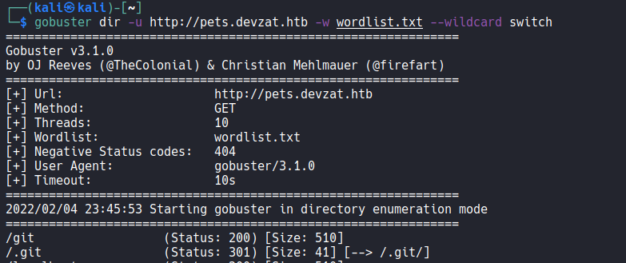
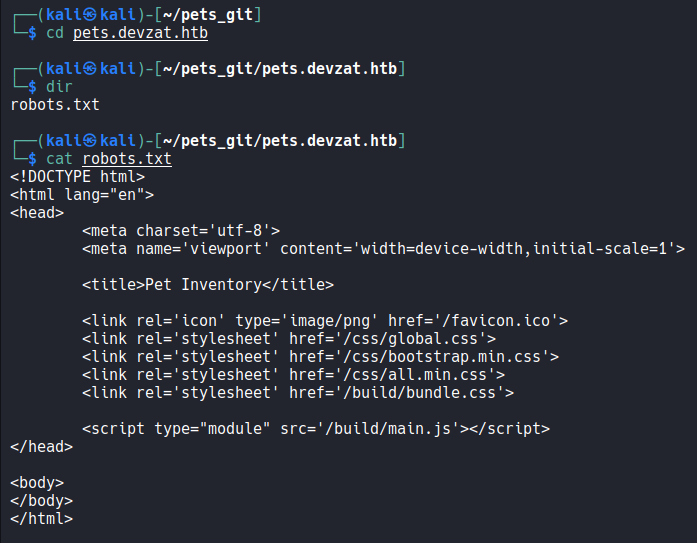
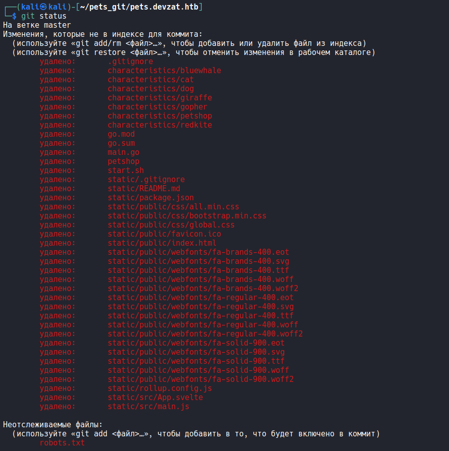
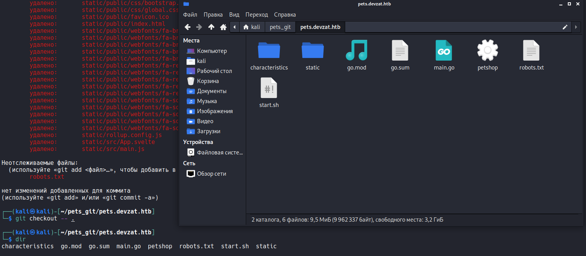
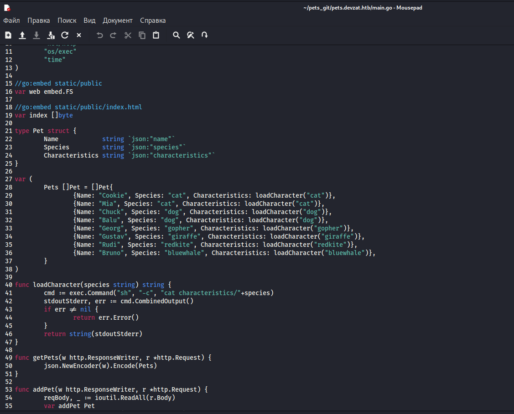
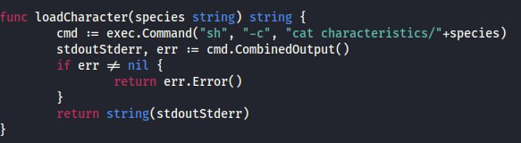
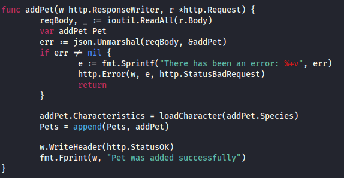

# Devzat (Medium)

Сначала найдем открытытые порты. Просканируем данный ip с помощью nmap.

Просмотрим порт 80 - HTTP. Главная страница сайта - чата для разработчиков.

Видим, что 2 ветки гита, 10 клиентов, ... Также предложение подключиться по ssh.

email patrick@devzat.htb. Ссылки на социалки не работают.

Здесь мы больше ничего не может найти. Попытаемся найти поддомены с помощью gobuster.
Словарь взят из: 
https://github.com/danielmiessler/SecLists/blob/master/Discovery/DNS/subdomains-top1million-110000.txt

Спустя некоторое нашелся первый поддомен - pets.devzat.htb

Видим таблицу записей о питомцах. Внизу страницы есть поле ввода.

exit status 1 вместо species.

Удаление записей не работает.

Больше ничего не нашли. Проверим pets на директории с gobuster.

Нашлась директория .git. Скачаем ее с помощью wget -r. Там только один файл - robot.txt

Проверим git status. Видим, что удалены все файлы. Попробуем восстановить.

Введем git checkout --., чтобы вернуться к предыдущему коммиту. Получаем набор файлов

в файле main.go находится код всех функций на сайте (добавление, удаление записи в таблице, само содержимое таблицы и пр.)

Однако замечаем интересную функцию load_character. Здесь вызывается команда (shell скрипт), в которую конкатенируется параметр species.

Эта функция вызывается при добавлении питомца. species - пользовательский ввод.

