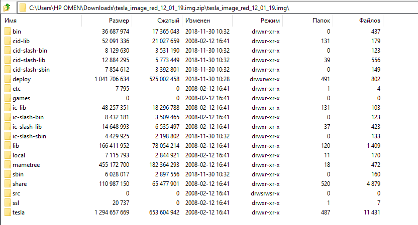
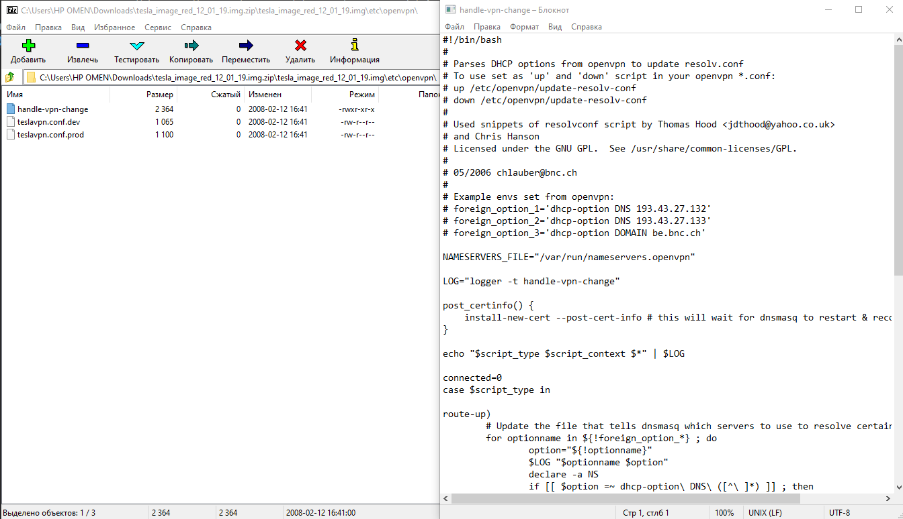
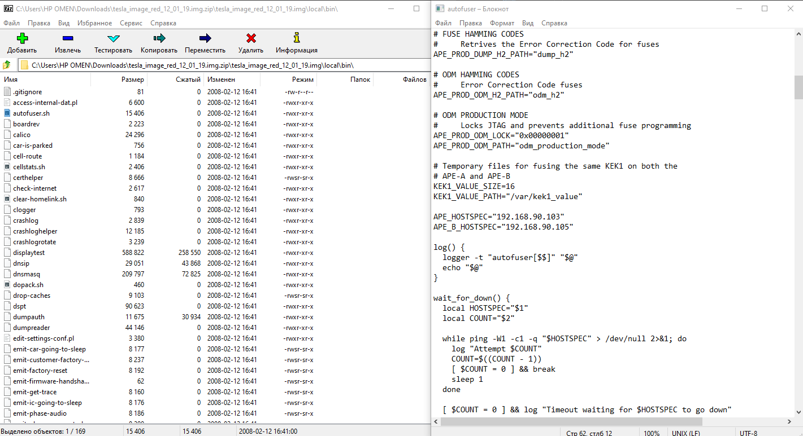
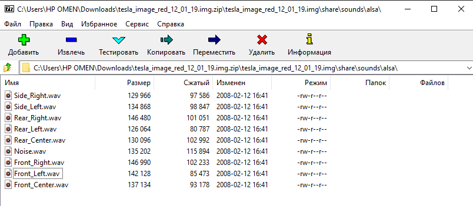
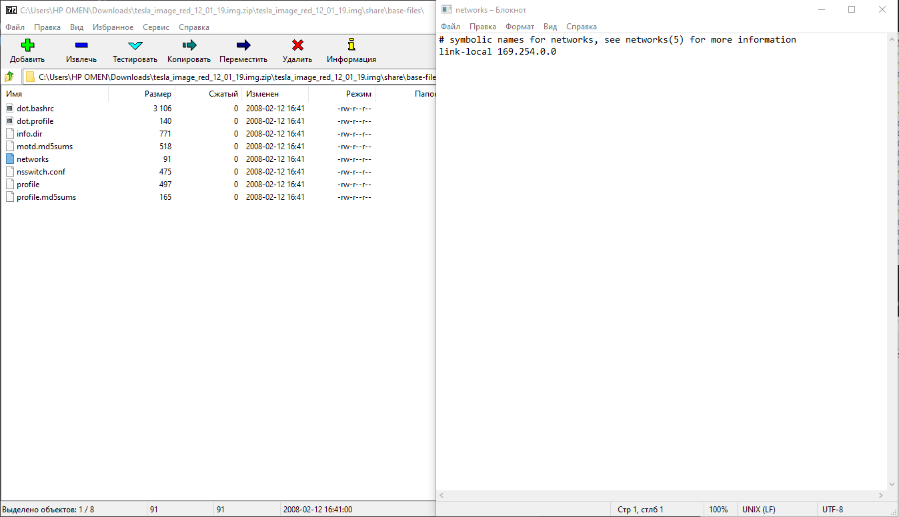
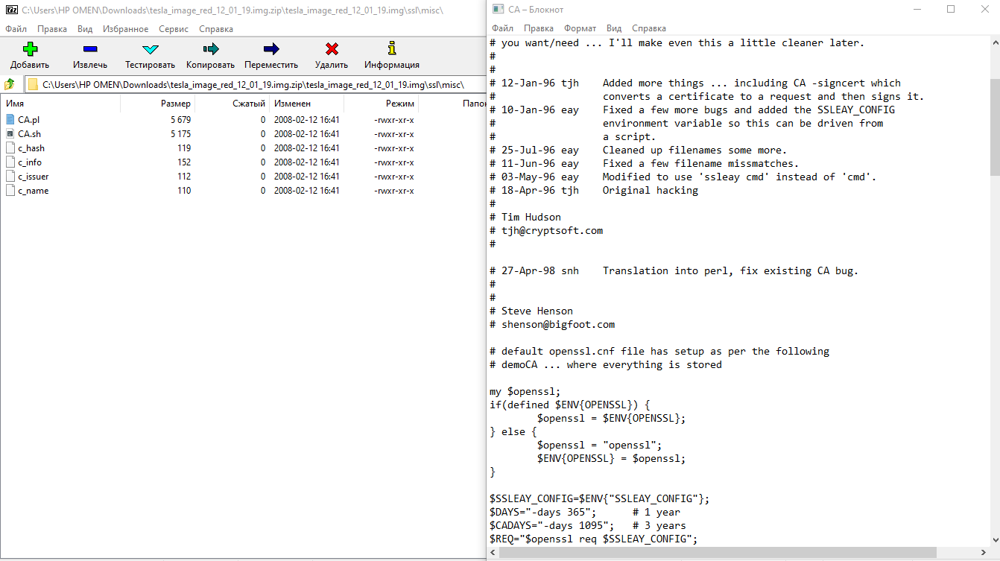

# Лабораторная №6 Исследование дампа машины Tesla

Работу выполнили: 
- Полеся Виталий
- Скопецкий Анатолий
## Постановка задачи:
Скачать образ виртуальной машины можно тут: https://disk.yandex.ru/d/4J_tc2sAFwtiDg.

## Техническое задание:
Необходимо провести анализ дампа операционной системы машины Tesla (да, той самой, 19го
года). Необходимо построить схему работы приложений внутри, большая часть из которых
являются веб приложениями. Внутри существует множество папок и файлов, содержащие
различные веб приложения, документацию, бортовые системы и т.д.. Образ 19го года, поэтому
данные приложения являются уязвимыми. Необходимо найти как минимум 2 уязвимости, либо
руководствуясь исходниками, которые есть в образе, либо можно запустить сервисы и найти их
вручную и эксплуатировать. Результатом работы будет карта образа, в любом удобном для вас
виде, mindmap, дерево папок с описанием и т.д., где должны быть описаны ключевые сервисы,
присутствующие в дампе. Второй частью задания найти уязвимости в данном дампе. С образом
разрешено производить все виды манипуляций.

---

## 7-zip

## Обзор директорий

### etc

В etc\openvpn видим скрипты настройки openvpn.

### local

В local\bin\ видим файл, в котором присутствуют какие-то ip. Ape-A и Ape-B - первичный и вторичный компьютеры автопилота.

### share

В share\sounds\alsa видим файлы аудио системы Alsa.

В share\base-files\ можно заметить какой-то ip адрес.

В share\ca-certificates\ находятся различны сертификаты

### ssl

В ssl\misc\ видим CA скрипт для openSSL, в нем есть 2 почты.

### tesla\UI

