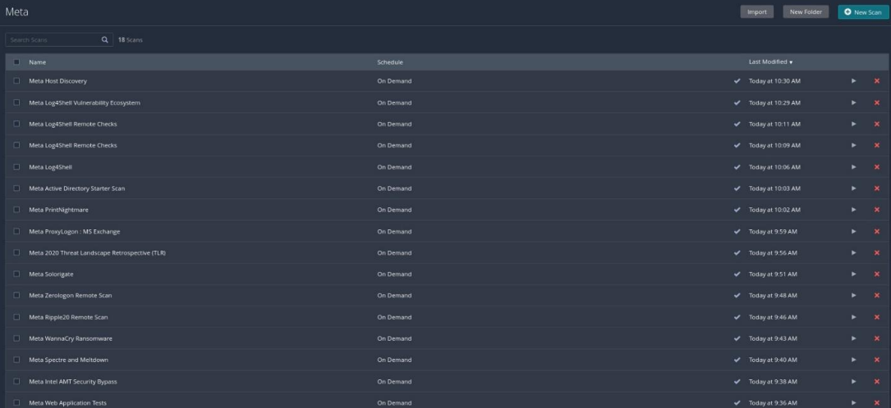

# Metasplotable3

## Nessus Pro

В тестах веб приложений видим ряд уязвимостей в версии PHP

В advanced scan также видим несколько уязвимостей

Information disclosure vulnerability

Medium strength encryption

## OpenVas

Снова видим ту же уязвимость information disclosure

Drupal Coder RCE

SSH brute force

remote FTP server brute force

PUT и DELETE методы

# Sn1per

# nmap

