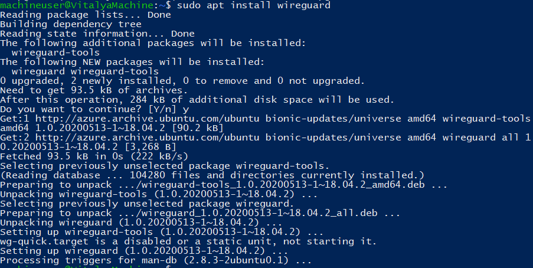
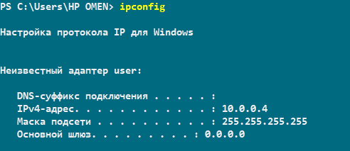

Установка WireGuard

Разрешаем пробрасывать пакеты

Генерируем ключи на сервере

Создаем конфиг wg0.conf

Запускаем сервис 

Генерируем ключи для клиента

Обновляем конфиг сервера wg0.conf, добавив в него раздел с клиентом

Создаем конфиг клиента

    [Interface]
    PrivateKey = OM3ynUSD0Q5xmGIner0Mbd7tt6bbwzrC8KnUPAdvm0U=
    Address = 10.0.0.4/32
    DNS = 8.8.8.8

    [Peer]
    PublicKey = wGYjhqzapB2sBdGUf9RVdJi3zarCQMr5rkc4fcXEfiY=
    AllowedIPs = 0.0.0.0/0
    Endpoint = 137.116.150.160:51820
    PersistentKeepalive = 20

Добавляем туннель в WireGuard

Вывод ipconfig

