# Лабораторная №1

Работу выполнили: 
- Полеся Виталий
- Скопецкий Анатолий

---

## Sonarqube + Jenkins

Docker Compose

Установка плагина Git для начала

Установка плагина Sonarqube Scanner

Добавляем сервер sonarqube в дженкинс

Создаем вебхук, вызываемый после завершения анализа

Создаем в сонаркубе проекты

Создаем вебхук в дженкинсе для гитхаба

Создаем айтем в дженкинсе

https://github.com/digininja/DVWA

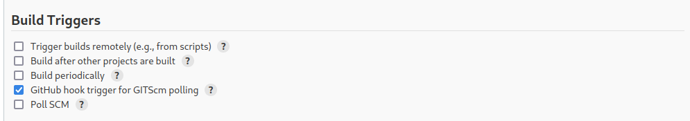

Запускаем билд

Проверяем сонаркуб

То же самое делаем с отсальными проектами

https://github.com/OWASP/Vulnerable-Web-Application

https://github.com/djadmin/vulnerable-app

Итог

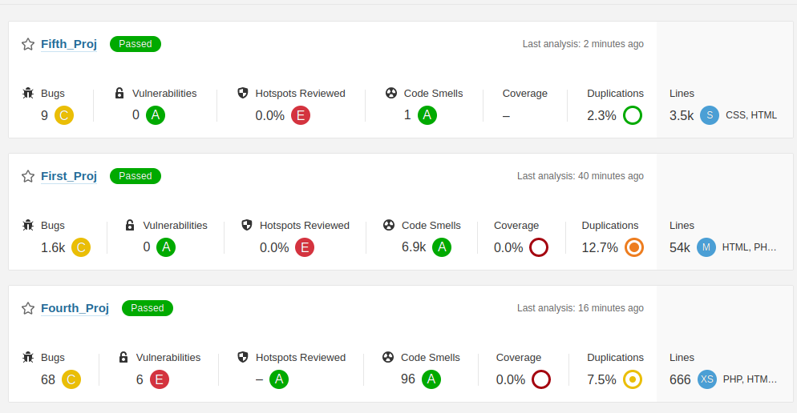

---

## Snyk

Установка как плагин для VS Code

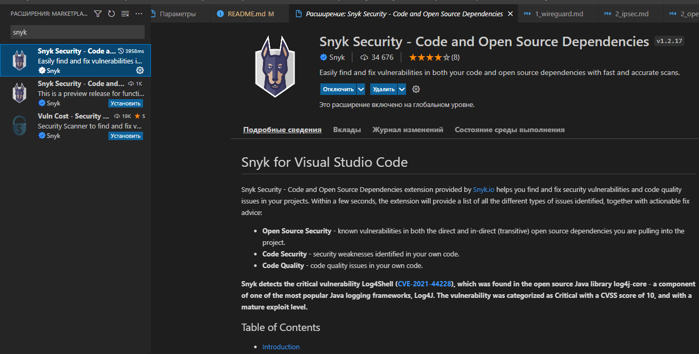

Проверка первого проекта

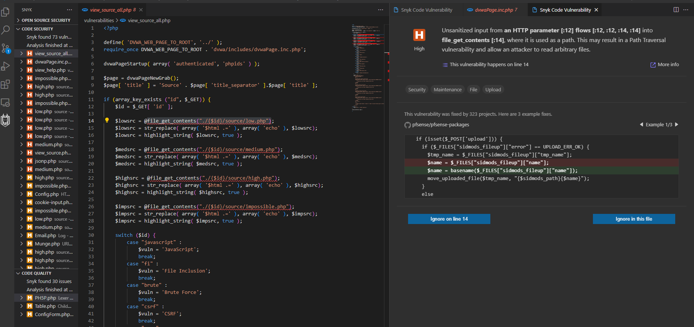

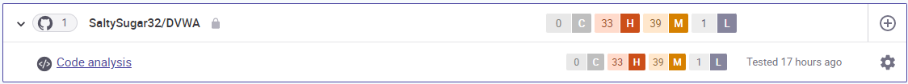

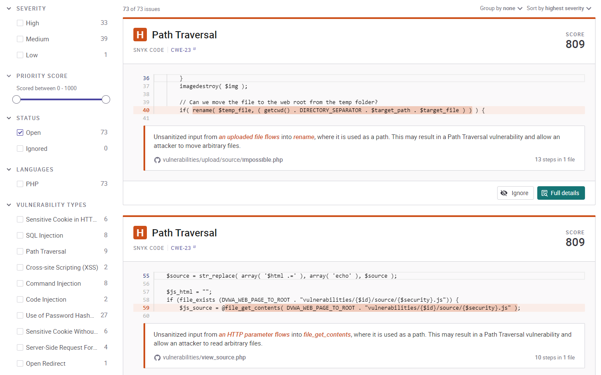

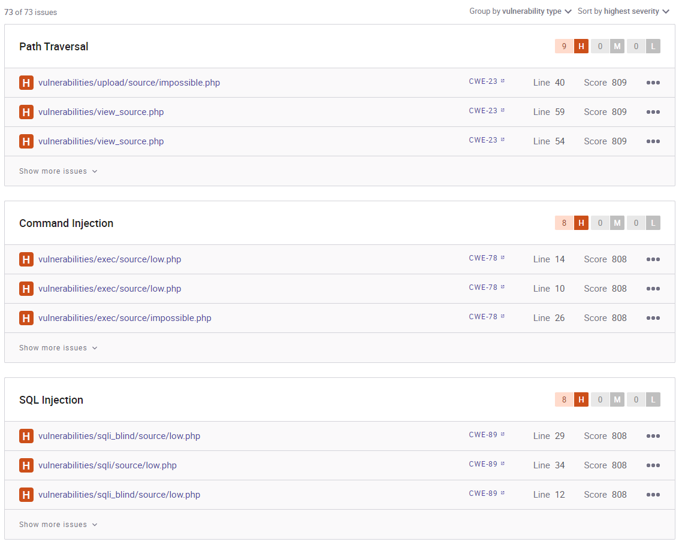

Второй проект

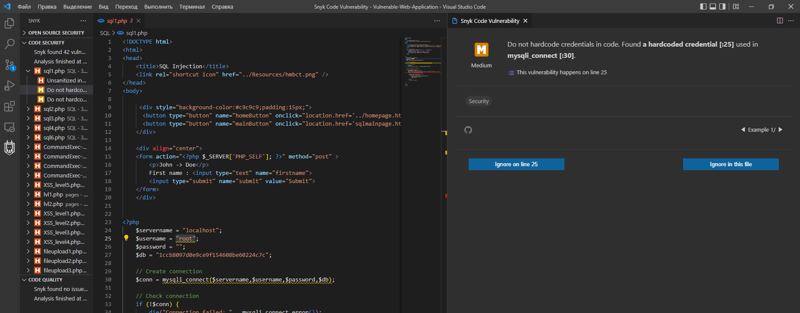

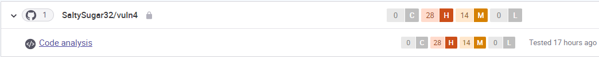

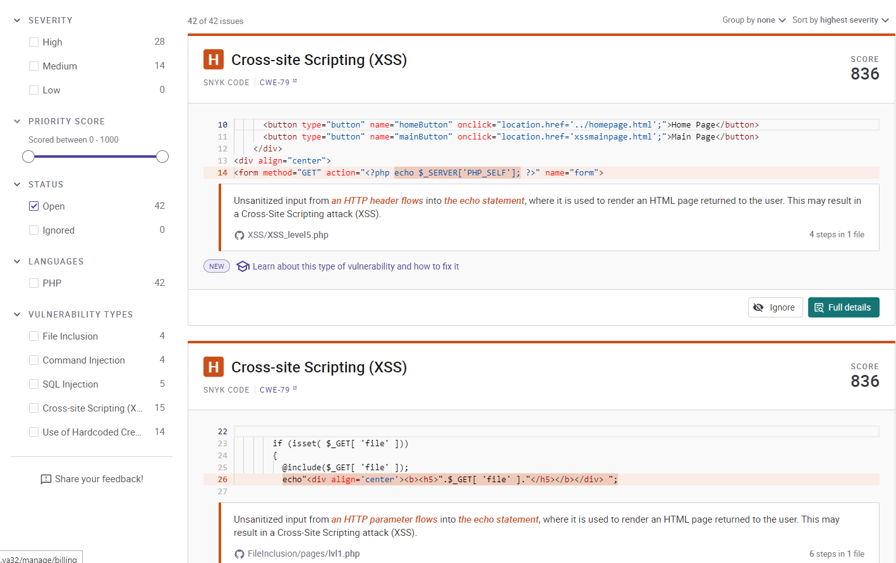

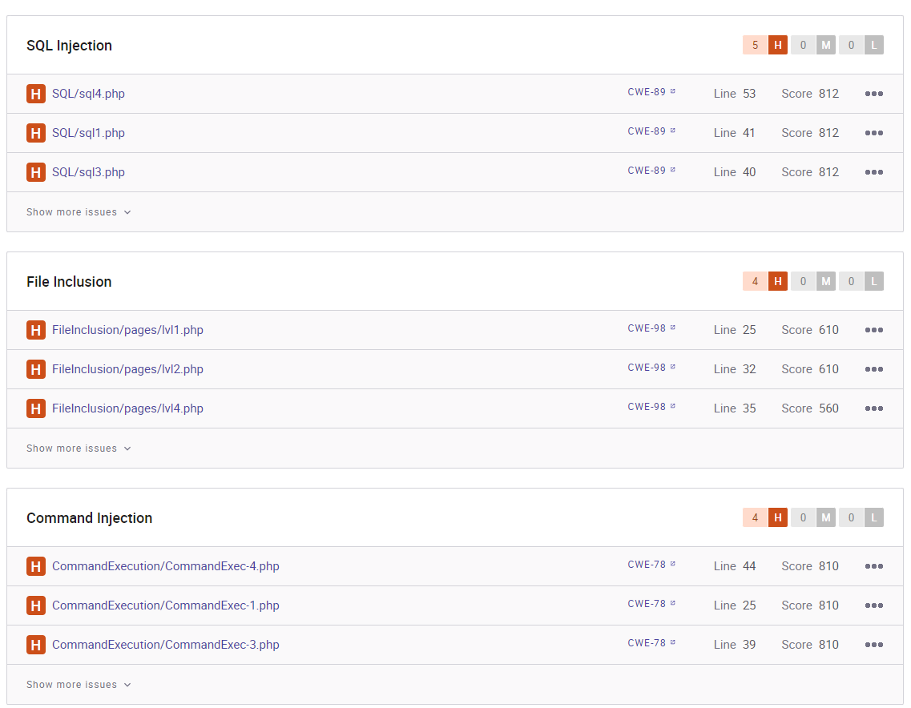

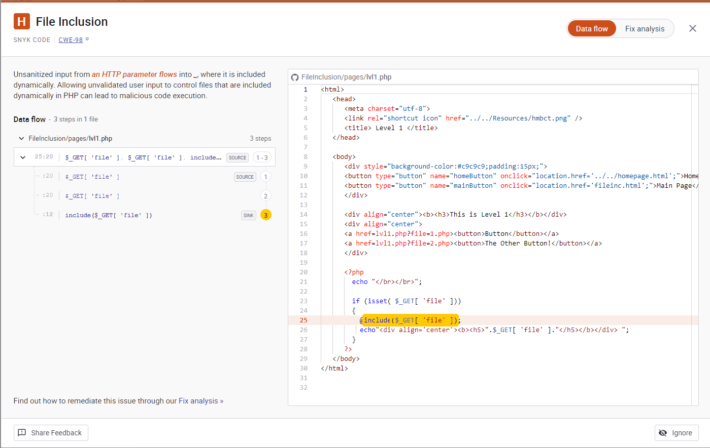

Третий проект

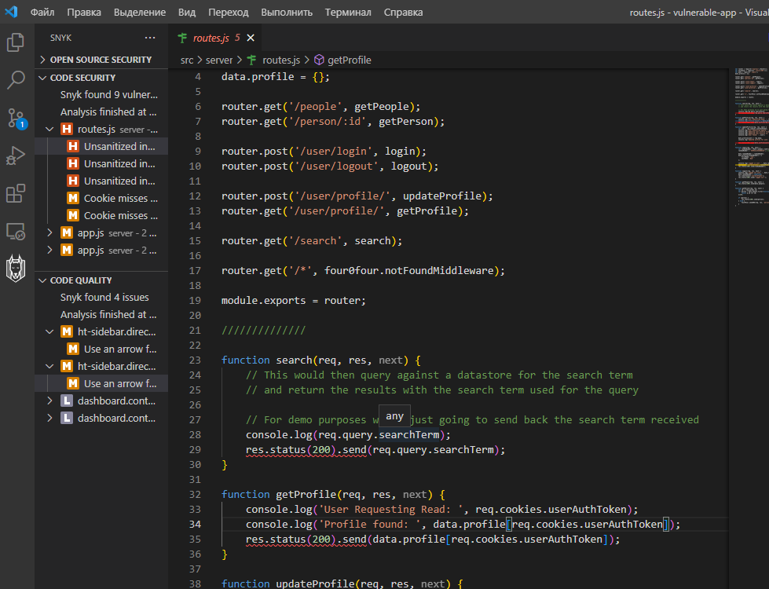

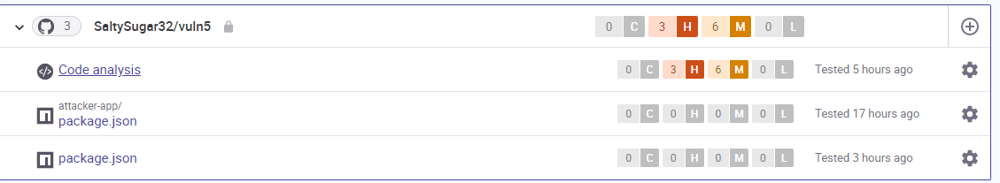

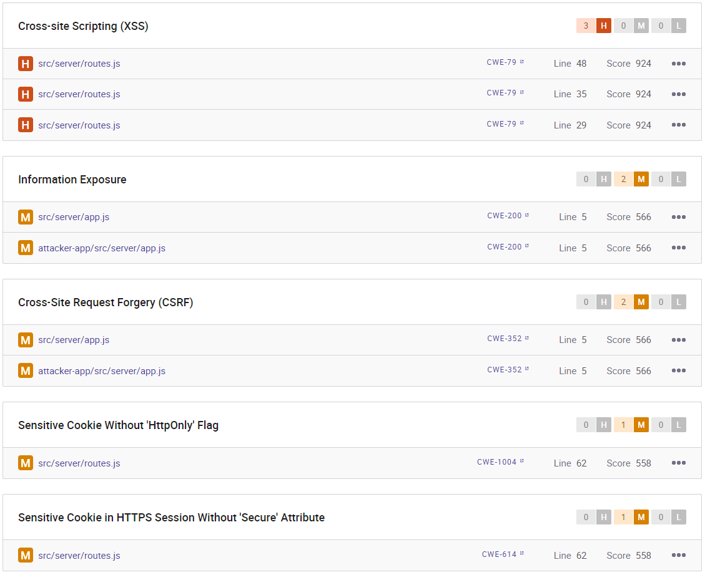

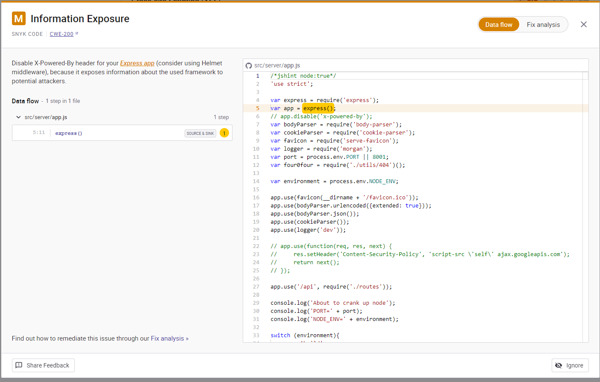

---

## Сравнение

Sonarqube

Snyk

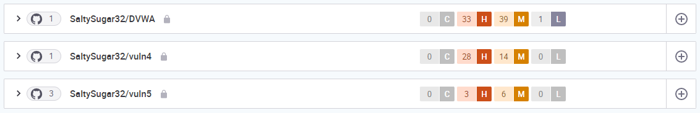