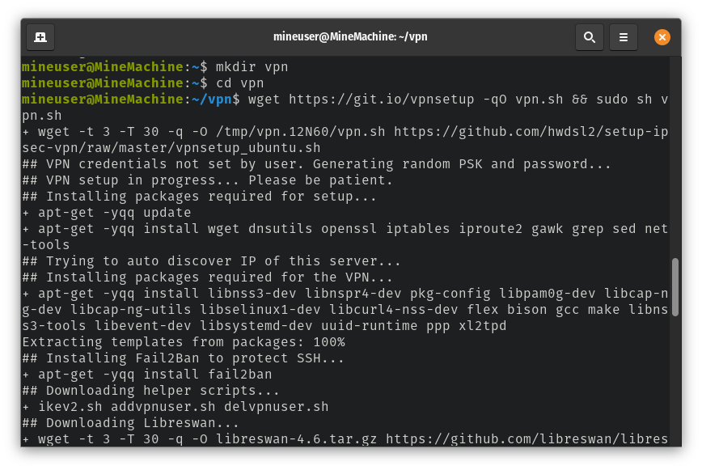
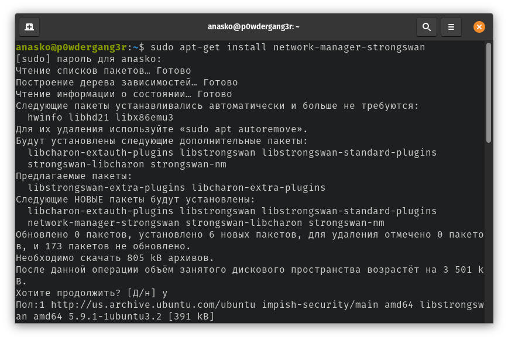
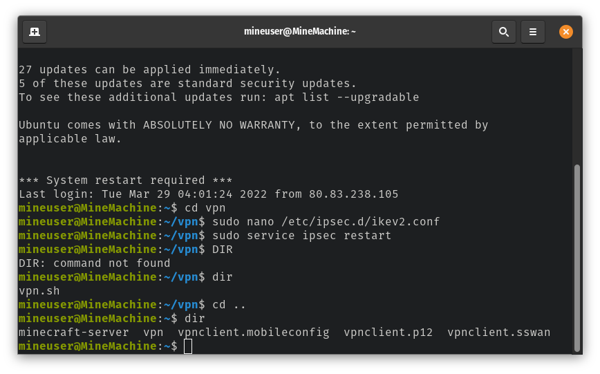
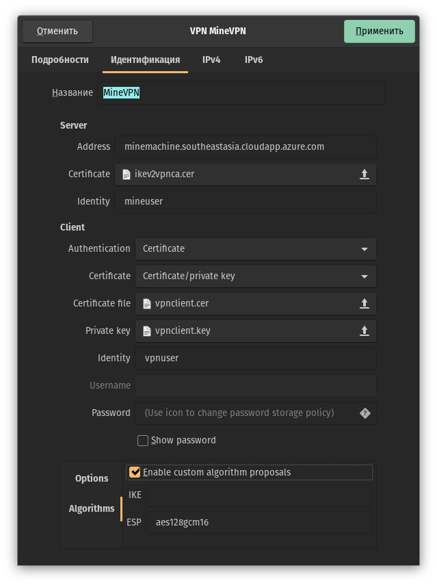
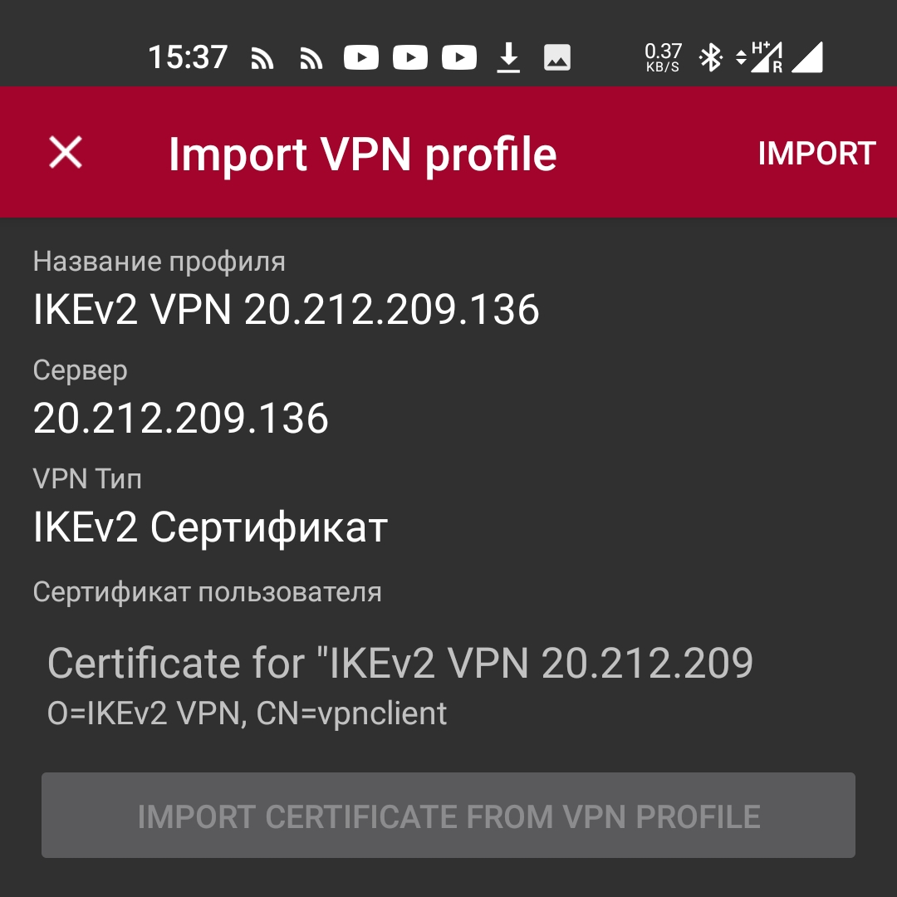

# Отчёт по лабораторной работе #3. Настройка IPSec/IKEv2
* Выполнили Полеся Виталий, Скопецкий Анатолий
* б9118-09.03.04прогин

## Ход работы
### Настройка сервера
* Готовая ВМ

* Пользуемся автоматической установкой из QuickStart

* Скачиваем автоматический установщик, производим установку

* Успешная установка. Пользователь по умолчанию IKEv2

* В конец файла добавлена поддержка RSA1 для подключения клиентов Linux.

## Настройка клиента

* Пошаговая настройка клиента.

* Перейдём к пункту Linux.

* Установка strongswan - поддержку IKEv1 и IKEv2 протоколов.

* Проверяем наличие .p12 набора сертификатов и ключей клиента vpnclient.

* Подмонтировал эту же папку к файловой системе и открыл через проводник.

* Произвёл перемещение, извлёк из данного "ахрива" сертификаты и ключ шифрования.

* Произвёл настройку vpn в настройках системы.

## Проверка работоспособности
* Проверил работоспособность VPN. Фото без VPN...

* ... и через VPN.

* Проверка наличия перенаправления пакетов на 20.212.209.136. Перенаравление происходит. Выделенный "адаптер" под VPN не создаётся.

## Технические проблемы
* Не работало подключение через VPN. Никак. Для проверки, что проблема не на клиенте спустя получаса различных проверок установил на андроид strongSwan VPN Client. Получил отказ работы. Попробовал создать авторазвёртывание. На этапе установки софта оно работать отказалось. Немного подумав, заглянул в открытые порты, перенёс открытые UDP порты в основную ВМ и всё заработало. Скрин работы на ведре ниже. Два открытых UDP порта тоже ниже.

* Android

* UDP
